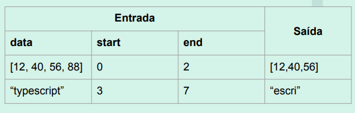

# ts_alpha

Crie um projeto em TypeScript, instalando as dependências que julgar necessárias. Seu projeto deve conter uma função que extrai subconjuntos. 

A função recebe 3 parâmetros: data (pode ser uma string ou um array de números); start (um número inteiro que indica o índice inicial) e end (um número inteiro que indica o índice final). Caso o parâmetro data seja uma string, o retorno da função deve ser uma string com todos os elementos de data do índice inicial (start) até o índice final (end); Analogamente, caso o parâmetro data seja um array de números, o retorno da função deve ser um array com todos os números de data que vão do índice inicial (start) até o índice final (end). 

Envie um arquivo compactado contendo: 

1. o projeto sem o node_modules;
2. um arquivo PDF mostrando um passo a passo com o build e a execução do código, de modo que contemple as duas situações. 

A tabela abaixo ilustra o resultado esperado para os dois tipos distintos de data. 

