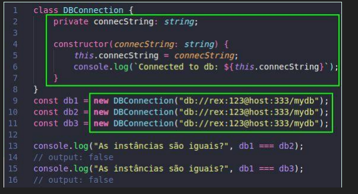

# ts_alpha

Crie um projeto em TypeScript, instalando as dependências que julgar necessárias. 
Envie um arquivo compactado contendo: 
- o projeto sem o node_modules; 
- um arquivo PDF mostrando um passo a passo com o build e a execução do código. 
 
Orientações sobre o projeto: 
- Transcreva o código da imagem abaixo para um arquivo index.ts. Você pode modificar/adicionar/excluir o conteúdo dos retângulos verdes. O código cria 3 objetos db1, db2 e db3, que simulam o acesso a um banco de dados fictício. As linhas 13 e 15 comparam esses objetos. Atualmente, o resultado é “false”, o que implica que são três variáveis contendo 3 instâncias diferentes, o que corresponde a 3 pontos de conexão ao banco de dados.
- Seu objetivo é garantir que as comparações retornem “true”. Você tem liberdade para modificar a classe livremente, adicionando, alterando ou excluindo propriedades e métodos. Retornar “true” significa que, embora três variáveis tenham sido inicializadas, elas referenciam a mesma instância de DBConnection. Em outras palavras, todas as variáveis apontam para a mesma instância da classe, garantindo que haja apenas um ponto de acesso ao banco de dados (dica: isso se chama “singleton pattern”, pesquise !)

