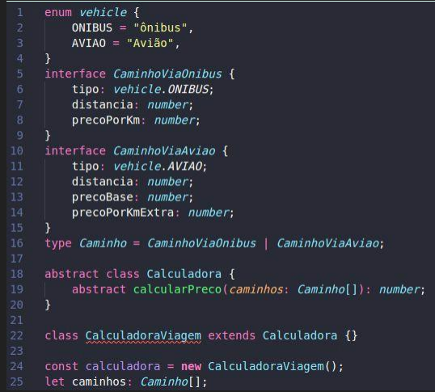

# ts_alpha

Crie um projeto em TypeScript, instalando as dependências que julgar necessárias. 
Envie um arquivo compactado contendo: 
- o projeto sem o node_modules; 
- um arquivo PDF mostrando um passo a passo com o build e a execução do código. 
 
Orientações sobre o projeto: 
- Tomando o códigoabaixo como base, implemente a classe CalculadoraViagem.
- Crie um array de Caminhos com pelo menos 4 elementos (contendo CaminhoViaOnibus e CaminhoViaAviao).
- Faça o cálculo do preço total da viagem.
- Todo o código precisa estar fortemente tipado.

